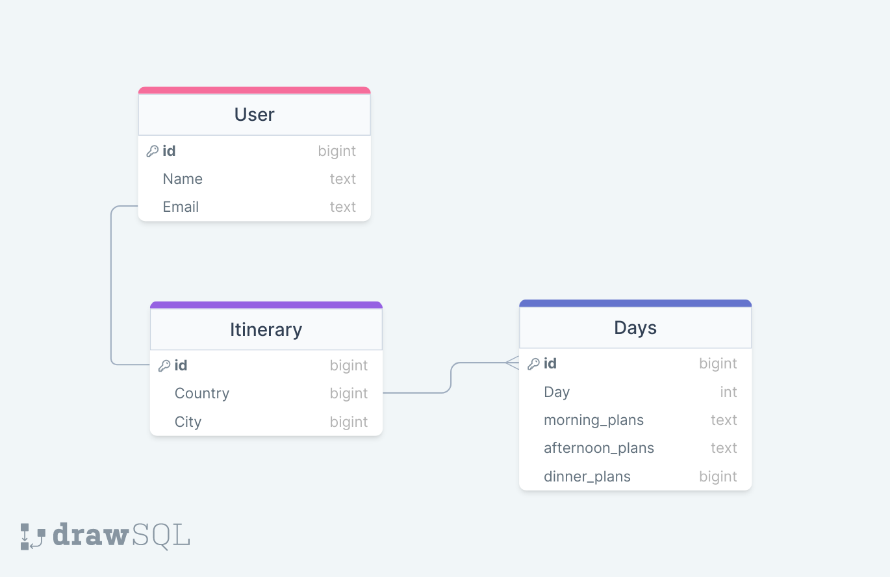
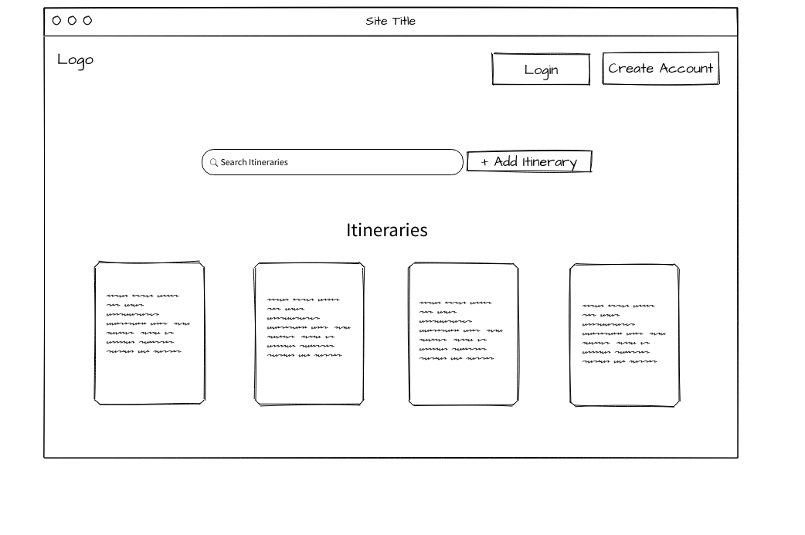
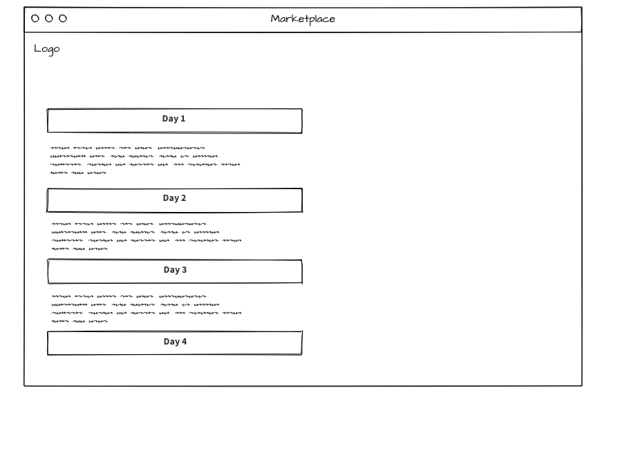

## Overview

Itinerary marketplace where travelers can share their past travel itineraries or search for them for an upcoming trip. No need to pay expensive travel agents, easily find unique and detailed plans for your upcoming trip.

### Technologies Used:

**Backend Repo**

- MongoDB
- Express

**Frontend Repo**

- HTML
- CSS
- Javascript
- ReactJS
- Nodejs
- Bootstrap
- TypeScript

### Routes

**Frontend Routes**

/ | GET | Index | Description: Show itineraries

/new | GET | New | Description: Create new itinerary

/contact/:Id | GET | Show | Description: Show itinerary with :id

/contact/:Id/edit | GET | show | Description: Show edit form for itinerary with :id

/contact/:Id/delete | GET | show | Description: Show delete form for itinerary with :id

**Backend Routes**

/ | POST | Create | Description: Create a itinerary

/:id | PATCH | Update | Description: Update itinerary with :id

/:id | DELETE | Destroy | Description: Delete itinerary with :id

### React Components Overview

Search bar Allow users to search for specific itinerary and add new itinerary.

Container that holds/displays itineraries in a paginated way

Itinerary Details Display additional details about individual itinerary

### Model

### Wireframes

---

